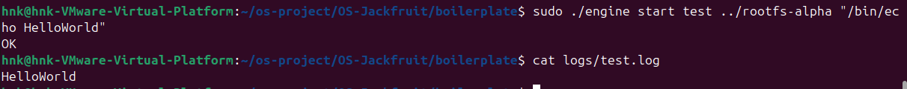
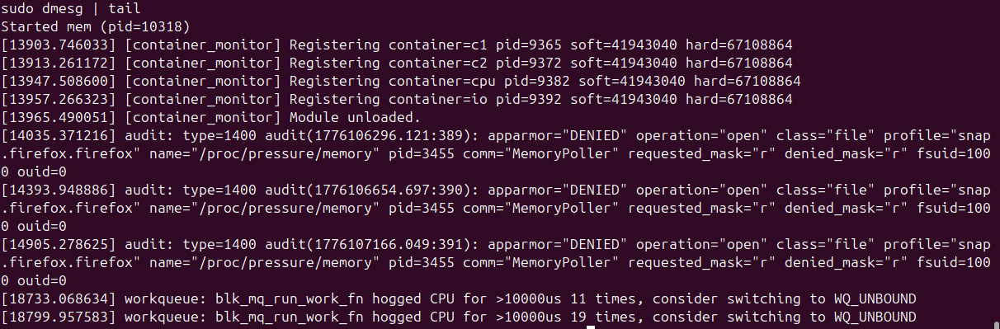
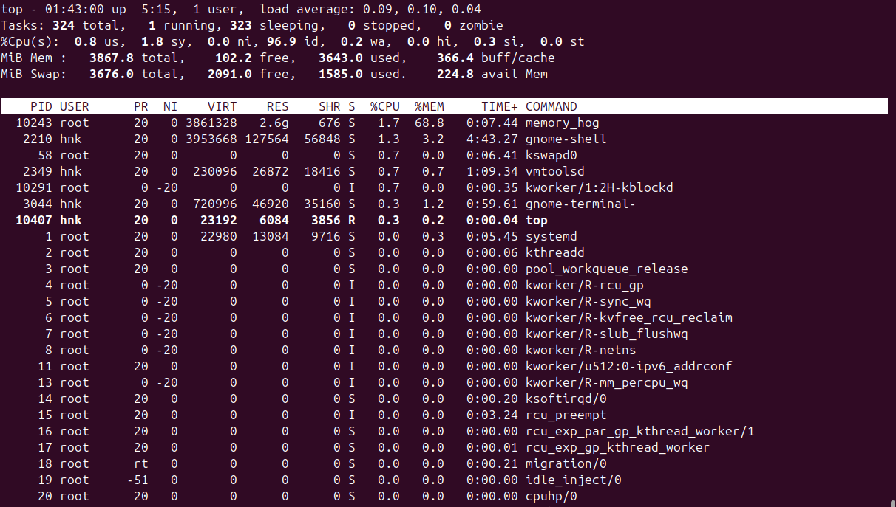
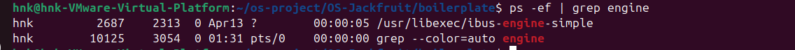
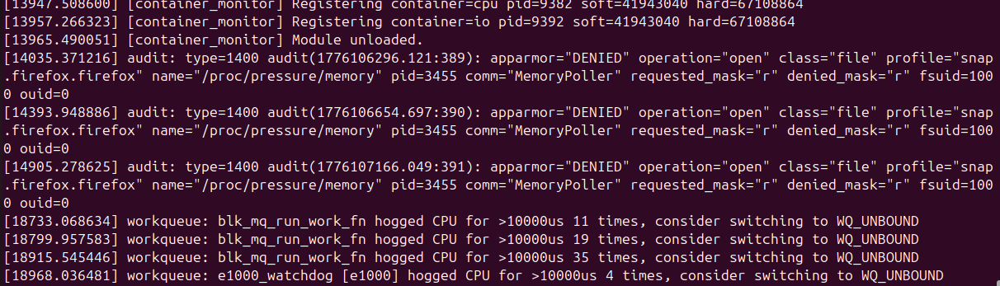
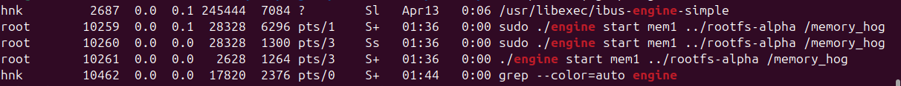

# Multi-Container Runtime with Kernel Memory Monitor

---

## 1. Team Information

* Name: Hariom N Kini
* SRN: PES2UG24CS672

* Name: Atul Kandiyil
* SRN: PES2UG24CS920

---

## 2. Project Overview

This project implements a lightweight Linux container runtime in C with:

* A user-space supervisor managing multiple containers
* A kernel-space memory monitoring module
* IPC between CLI and supervisor via UNIX domain sockets
* Per-container logging using a bounded buffer
* Namespace-based isolation (PID, UTS, Mount)
* Scheduling and memory limit experiments

The system demonstrates core OS concepts including process isolation, scheduling behavior, inter-process communication, and kernel-level resource enforcement.

---

## 3. Build, Load, and Run Instructions

### Environment Setup

```bash
sudo apt update
sudo apt install -y build-essential linux-headers-$(uname -r)
```

Requirements:

* Ubuntu 22.04 / 24.04 VM
* Secure Boot OFF
* Not supported on WSL

---

### Clone Repository

```bash
git clone https://github.com/<your-username>/OS-Jackfruit.git
cd OS-Jackfruit
```

---

### Build Project

```bash
cd boilerplate
make
```

CI-safe build:

```bash
make ci
```

---

### Prepare Root Filesystem

```bash
cd ..
mkdir rootfs-base
wget https://dl-cdn.alpinelinux.org/alpine/v3.20/releases/x86_64/alpine-minirootfs-3.20.3-x86_64.tar.gz
tar -xzf alpine-minirootfs-3.20.3-x86_64.tar.gz -C rootfs-base
```

Create per-container rootfs:

```bash
cp -a rootfs-base rootfs-alpha
cp -a rootfs-base rootfs-beta
```

Copy workloads into container rootfs:

```bash
cp cpu_hog rootfs-alpha/
cp memory_hog rootfs-alpha/
cp cpu_hog rootfs-beta/
cp memory_hog rootfs-beta/
```

---

### Load Kernel Module

```bash
cd boilerplate
sudo insmod monitor.ko
ls -l /dev/container_monitor
dmesg | tail
```

---

### Start Supervisor

```bash
sudo ./engine supervisor ../rootfs-base
```

---

### Run Containers

Open a new terminal:

```bash
cd boilerplate
sudo ./engine start alpha ../rootfs-alpha /bin/sh
sudo ./engine start beta ../rootfs-beta /bin/sh
```

Foreground execution:

```bash
sudo ./engine run alpha ../rootfs-alpha "/cpu_hog"
sudo ./engine run mem ../rootfs-alpha "/memory_hog"
```

---

### CLI Commands

```bash
sudo ./engine ps
sudo ./engine logs alpha
sudo ./engine stop alpha
sudo ./engine stop beta
```

---

### Check Kernel Logs

```bash
sudo dmesg | tail
```

---

### Cleanup

Stop containers:

```bash
sudo ./engine stop alpha
sudo ./engine stop beta
```

Unload module:

```bash
sudo rmmod monitor
```

Clean build:

```bash
make clean
```

Verify no zombie processes:

```bash
ps aux | grep defunct
```

---

## 4. Architecture Overview

The system consists of:

### User-space Runtime (engine.c)

* Long-running supervisor
* CLI client interface
* Container lifecycle management
* Logging pipeline

### Kernel Module (monitor.c)

* Tracks container processes
* Enforces memory limits
* Uses ioctl for communication

---

## 5. Engineering Analysis

### 5.1 Isolation Mechanisms

The runtime achieves isolation using Linux namespaces:

* **PID Namespace**: Each container has its own process tree
* **UTS Namespace**: Each container has its own hostname
* **Mount Namespace**: Filesystem view is isolated

Filesystem isolation is achieved using `chroot`, which restricts the container to its rootfs directory.

Inside the container:

```c
mount("proc", "/proc", "proc", 0, NULL);
```

This enables process visibility tools like `ps`.

Shared kernel resources (CPU scheduler, physical memory, kernel data structures) are shared across containers — they are isolated but share the same kernel.

---

### 5.2 Supervisor and Process Lifecycle

A long-running supervisor is essential because it manages multiple containers concurrently, maintains metadata (PID, state, limits), and acts as the parent of all containers.

Process lifecycle:

1. Supervisor calls `clone()`
2. Child runs container workload
3. Supervisor tracks PID
4. `SIGCHLD` is used to detect exit
5. `waitpid()` reaps child to prevent zombies

Signal handling:

* `stop` sends SIGTERM
* Hard limit sends SIGKILL from kernel module
* Supervisor distinguishes termination cause

---

### 5.3 IPC, Threads, and Synchronization



Two IPC mechanisms are used:

#### Path A: Logging (Pipes)

* Container stdout/stderr forwarded to supervisor via pipes
* Producer threads read from pipe
* Consumer thread writes to log files

#### Path B: Control (UNIX Socket)

* CLI to supervisor communication
* Commands: start, stop, ps, logs

#### Bounded Buffer Design

```
Producers -> bounded buffer -> Consumer
```

Synchronization:

* Mutex protects shared buffer
* Condition variables:
  * `not_full` for producer waiting
  * `not_empty` for consumer waiting

#### Race Conditions Prevented

| Problem             | Solution            |
| ------------------- | ------------------- |
| Concurrent writes   | Mutex               |
| Buffer overflow     | Blocking producer   |
| Lost logs           | Controlled shutdown |
| Consumer starvation | Condition signaling |

---

### 5.4 Memory Management and Enforcement



RSS (Resident Set Size) measures physical memory used by a process. It does not include swapped-out pages or full shared memory.

Policy design:

* **Soft limit**: Logs a warning once, does not kill the process
* **Hard limit**: Enforced strictly, sends SIGKILL

Kernel-space enforcement is used because user-space cannot reliably monitor memory in real time or prevent runaway processes. The kernel has direct access to memory statistics, can enforce immediately, and cannot be bypassed.

---

### 5.5 Scheduling Behavior



Experiments with CPU-bound workloads and different nice values demonstrate Linux CFS behavior:

* **Case 1 — CPU-bound vs CPU-bound**: Lower nice value (`--nice -10`) gets more CPU time and completes faster
* **Case 2 — CPU-bound vs I/O-bound**: I/O-bound process remains responsive while CPU-bound uses remaining CPU time

Linux scheduler aims for fairness, responsiveness, and throughput.

---

## 6. Design Decisions and Tradeoffs

| Component      | Choice              | Tradeoff                    |
| -------------- | ------------------- | --------------------------- |
| Isolation      | chroot              | Less secure than pivot_root |
| IPC            | UNIX socket         | More setup complexity       |
| Logging        | bounded buffer      | Requires synchronization    |
| Kernel monitor | linked list + mutex | Some overhead               |
| Scheduling     | nice values         | Limited control             |

---

## 7. Scheduler Experiment Results


| Workload | Nice | Completion Time |
| -------- | ---- | --------------- |
| cpu_hog  | -10  | Faster          |
| cpu_hog  | 10   | Slower          |

**Conclusion:** Scheduler prioritizes lower nice value, confirming fairness and priority behavior of the Linux CFS.

---

## 8. Boilerplate Contents

The `boilerplate/` directory contains:

* `engine.c` — user runtime and supervisor
* `monitor.c` — kernel module
* `monitor_ioctl.h` — shared interface
* `cpu_hog.c`, `memory_hog.c`, `io_pulse.c` — workloads
* `Makefile` — build system

---

## 9. Demo Checklist (Screenshots)

1. Multiple containers running


2. `ps` output / Metadata tracking



3. Logging system output (Bounded Buffer)


4. Soft and Hard Memory Limits


5. CPU Usage Comparison


6. Execution Time Comparison


7. Kernel Module Load/Unload



8. No Zombie Processes


